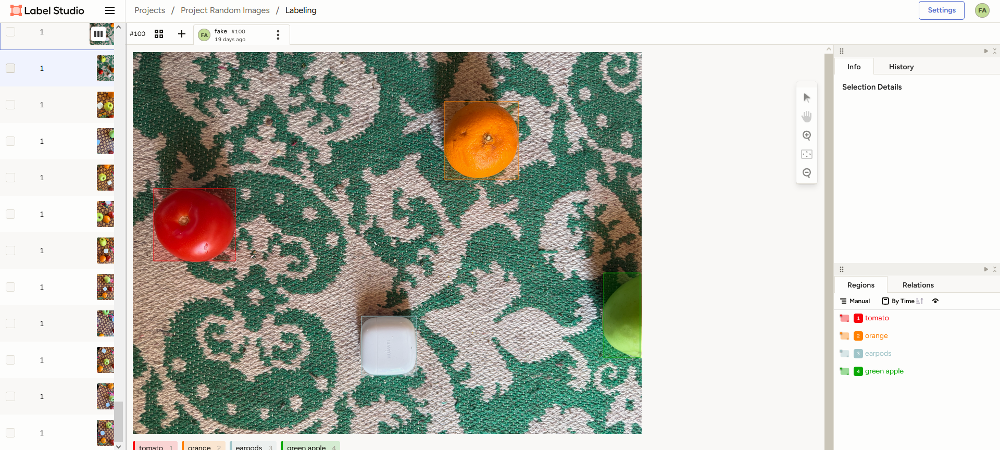
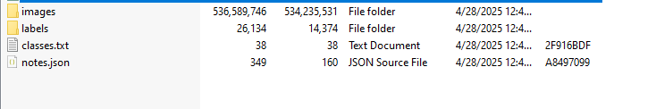
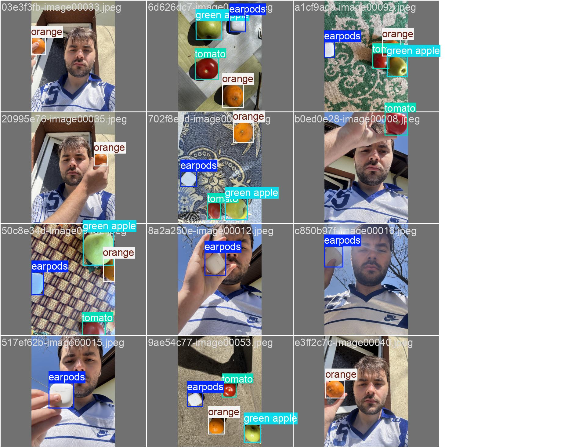

# Object-Recognition-YOLOv11n

This project demonstrates object detection using the YOLOv11 model, based on Edjie Electronics' comprehensive tutorial.

## Train YOLO Models

The YOLO model was trained using a Google Colab notebook designed specifically for training Ultralytics YOLO models. You can find the original notebook here:

https://colab.research.google.com/github/EdjeElectronics/Train-and-Deploy-YOLO-Models/blob/main/Train_YOLO_Models.ipynb#scrollTo=1sUfcA8ZgR2t

### Gather and uploading training images

To train the model, I collected images of various objects and labeled them. While the tutorial suggests using 200 images for a proof-of-concept model, my dataset consisted of approximately 120 images featuring four distinct objects. The images included diverse backgrounds and lighting conditions to improve the model's robustness.

Labeling was performed using Label Studio, an open-source annotation tool that balances simplicity with advanced features. Installation was done through Anaconda along with Ultralytics.

Label Studio was installed using Anaconda and Ultralytics.

```
conda create --name yolo11-env python=3.12 -y
conda activate yolo11-env
```


After labeling, there will be a `project.zip` containing the following:
* An `images` folder for images
* A `labels` folder containing the labels in YOLO
* A `classes.txt` labelmap



## Uploading Image Dataset and Prepare Training Data

Once the dataset was uploaded, the following command was used to extract it:

```
!unzip -q /content/data.zip -d /content/custom_data
```

Ultralytics requires a specific folder structure for training data. The "data" root directory contains two main subfolders:

Train: Holds images used for model training. Each training epoch processes all images in this folder to adjust model weights.

Validation: Contains images used to evaluate model performance at the end of each epoch.

## Configure Training

To streamline the training setup, I created a `data.yaml` file that defines the paths to training and validation data, as well as the model's classes. Here’s the Python code used to generate it:

```
import yaml
import os

def create_data_yaml(path_to_classes_txt, path_to_data_yaml):

  # Read class.txt to get class names
  if not os.path.exists(path_to_classes_txt):
    print(f'classes.txt file not found! Please create a classes.txt labelmap and move it to {path_to_classes_txt}')
    return
  with open(path_to_classes_txt, 'r') as f:
    classes = []
    for line in f.readlines():
      if len(line.strip()) == 0: continue
      classes.append(line.strip())
  number_of_classes = len(classes)

  # Create data dictionary
  data = {
      'path': '/content/data',
      'train': 'train/images',
      'val': 'validation/images',
      'nc': number_of_classes,
      'names': classes
  }

  # Write data to YAML file
  with open(path_to_data_yaml, 'w') as f:
    yaml.dump(data, f, sort_keys=False)
  print(f'Created config file at {path_to_data_yaml}')

  return

# Define path to classes.txt and run function
path_to_classes_txt = '/content/custom_data/classes.txt'
path_to_data_yaml = '/content/data.yaml'

create_data_yaml(path_to_classes_txt, path_to_data_yaml)

print('\nFile contents:\n')
```

## Train Model

The data is organized and the configuration file is created, it is time to start training. But there are some parameters to decide on.

* Model architecture & size:
  There are several YOLO11 models sizes available to train. Larger models run slower but have higher accuracy, while smaller models run faster buy have lower accuracy.

* Number of epochs:
  In machine learning, one epoch is one single pass through the full training dataset. Setting the number of epochs dictates how long the model will train for.

* Resolution:
  Resolution has a large impact on the speed and accuracy of the model: a lower resolution model will have higher speed but lower accuracy. YOLO models are typically trained and inferenced at a 640x640 resolution.

The following code block will begin the train : 
```
!yolo detect train data=/content/data.yaml model=yolo11s.pt epochs=60 imgsz=640
```

## Test model
After training, I tested the model on validation images. The following command runs inference and displays results for the first 10 images:

```
!yolo detect predict model=runs/detect/train/weights/best.pt source=data/validation/images save=True

import glob
from IPython.display import Image, display
for image_path in glob.glob(f'/content/runs/detect/predict/*.jpg')[:10]:
  display(Image(filename=image_path, height=400))
  print('\n')
```



## Deploy Model

Once the model was trained, it was ready for deployment on various platforms. YOLO models are versatile and can run on PCs, embedded systems, and even mobile devices. Ultralytics simplifies converting models into formats like TensorFlow Lite (TFLite) or ONNX for diverse applications.

Next, we'll take our downloaded model and run it on a local device. This section provides instructions showing how to deploy YOLO models on various devices.

The follwing python script from Edjie Electronics, yolo_detect.py, that shows how to load a model, run inference on an image source, parse the inference results, and display boxes around each detected class in the image. The script gives an example of how to work with Ultralytics YOLO models in Python, and it can be used as a starting point for more advanced applications.

### Deploy on PC

The easiest way to run Ultralytics models on a PC is using Anaconda. Anaconda sets up a virtual Python environment and allows you to easily install Ultralytics and PyTorch. It automatically installs CUDA and cuDNN, which allows you to speed up model inference with your NVIDIA GPU.

1. Download and Install Anaconda

Go to the Anaconda download page at https://anaconda.com/download, click the “skip registration” button, and then download the package for your OS. When it's finished downloading, run the installer and click through the installation steps. You can use the default options for installation.

2. Set up virtual environment

Once it's installed, run Anaconda Prompt from the Start Bar. (If you're on macOS or Linux, just open a command terminal).

Issue the following commands to create a new Python environment and activate it:

```
conda create --name yolo-env1 python=3.12 -y
conda activate yolo-env1
```

Install Ultralytics (which also installs import libraries like OpenCV-Python, Numpy, and PyTorch) by issuing the following command:

```
pip install ultralytics
```

3. Extract downloaded model Take the my_model.zip file you downloaded in Step 7.1 and unzip it to a folder on your PC. In the Anaconda Prompt terminal, move into the unzipped folder using:

```
cd path/to/folder
```

4. Download and run yolo_detect.py

Download the yolo_detect.py script into the my_model folder using:

```
curl -o yolo_detect.py https://raw.githubusercontent.com/EdjeElectronics/Train-and-Deploy-YOLO-Models/refs/heads/main/yolo_detect.py
```

To run inference with a yolov8s model on a USB camera at 1280x720 resolution, issue:

```
python yolo_detect.py --model my_model.pt --source usb0 --resolution 1280x720
```
A window will appear showing a live feed from your webcam with boxes drawn around detected objects in each frame.


